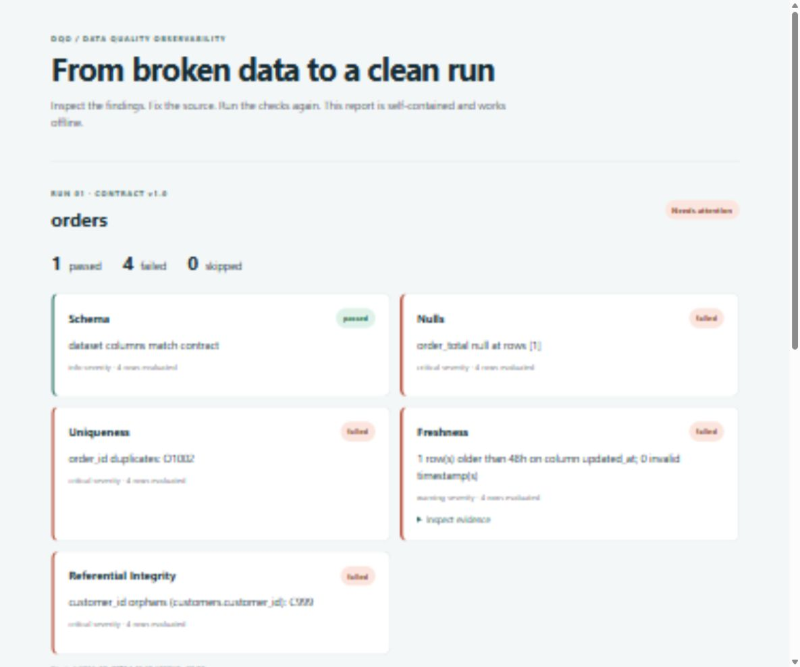

# Data Quality Observability

**Check CSV data contracts. Inspect failures. Share an offline report.**

[](https://github.com/br413/data-quality-observability/actions/workflows/ci.yml)
[](pyproject.toml)
[](LICENSE)

DQO is a small Python CLI for teams exchanging CSV data. Define expectations in YAML,
check a delivery, and get a readable HTML report or structured JSON for automation.
Run locally with SQLite; no cloud account, Airflow, or database server required.

## Try the broken-to-fixed demo

```bash
git clone https://github.com/br413/data-quality-observability.git
cd data-quality-observability
python -m venv .venv
```

Activate the environment:

```bash
# macOS / Linux
source .venv/bin/activate
# Windows PowerShell
.\.venv\Scripts\Activate.ps1
```

```bash
python -m pip install .
dqo demo
```

Open **`dqo-demo/report.html`** in your browser. The demo creates two runs:

| Run | What you see |
| --- | --- |
| Broken delivery | Missing order total, duplicate order ID, stale timestamp, unknown customer |
| Corrected delivery | All five checks pass |

The folder includes the input CSVs, contract, SQLite history, and JSON report.
Freshness uses a fixed reference time so this example keeps working in the future.
`dqo demo --output another-demo` creates a fresh copy; existing directories are never overwritten.



## Check your own data

Create `customers.yaml`:

```yaml
name: customers
version: "1.0"
columns:
  customer_id:
    type: string
    nullable: false
    unique: true
  email:
    type: string
    nullable: false
```

For a CSV with `customer_id,email` columns:

```bash
dqo run --contract customers.yaml --data customers.csv --report report.html
```

Use `--report report.json` for machine-readable output. Reports are written even when
quality checks fail. The extension selects the format; existing report files are replaced.

**Exit codes:** `0` = no failed checks, `1` = quality failure, `2` = invalid input or file error.
Optional checks without rules appear as **skipped**, not passed.

```bash
# View local history
dqo history --contract customers

# Check the bundled sample without time-dependent freshness failures
dqo run --contract contracts/orders.yml --data data/samples/orders.csv --references data/samples --reference-time 2026-07-14T12:00:00Z --report orders.html
```

The legacy `python -m src.dqo.cli` commands still work from a source checkout.

## What is checked?

| Check | Behavior |
| --- | --- |
| Schema | Required and unexpected column names; dependent checks skip on a mismatch |
| Nullability | Required values are populated |
| Uniqueness | Duplicate values in columns marked `unique` |
| Freshness | Each row's timestamp against a maximum age; malformed timestamps fail |
| Referential integrity | Foreign keys resolve against CSV reference tables |

Add freshness and reference rules using [the orders contract](contracts/orders.yml).
Contract names can resolve through [the versioned registry](contracts/registry.yml).

## Where DQO fits

Use it for a local CSV delivery check, a reproducible quality incident, or a CI gate
that produces an artifact colleagues can open without running an application.

Current limits are explicit:

- CSV inputs are loaded into memory. This is not a warehouse-scale query engine.
- Column `type` is descriptive metadata today; general type coercion/validation is not implemented.
- Reports show check findings and limited evidence, not a complete failed-row explorer.
- No web server, upload interface, Parquet input, or database dataset connector yet.
- PostgreSQL support stores **run history**; it does not scan PostgreSQL datasets.
- Reports and alerts can include sample identifiers. Review them before sharing.
- Empty datasets and skipped checks do not establish that data is fit for use.

## Automation and optional integrations

`dqo run` works in any CI runner with Python. Preserve `report.html` as a build artifact
and let exit code `1` stop publication of a failing delivery.
The JSON export has `schema_version: 1`, a `runs` array, and per-check statuses and metadata.

Local history defaults to `.dqo/history.db`. Set `--history-db` or `DQO_DATABASE_URL`
to select another store. Install PostgreSQL support with `python -m pip install '.[postgres]'`.

[Airflow scheduling](docs/scheduling.md), [alert routing and triage](docs/operations.md),
and [architecture decisions](docs/architecture.md) remain available for integrations.
The CLI and demo do not require Airflow.

## Help shape the next release

Try DQO on a small dataset and [tell us what blocked you](https://github.com/br413/data-quality-observability/issues/new/choose).
Include a tiny anonymized example, the command you ran, and the result you expected.

We welcome fixes, documentation improvements, and focused tests. Start with
[CONTRIBUTING.md](CONTRIBUTING.md) and the [roadmap](docs/roadmap.md).
The next priorities are structured failing-row evidence, stricter contract validation,
and larger-file execution. These are planned, not released features.

If DQO is useful to you, a star helps others discover it.

MIT licensed. Built and maintained by [Bobby Ray](https://github.com/br413).
